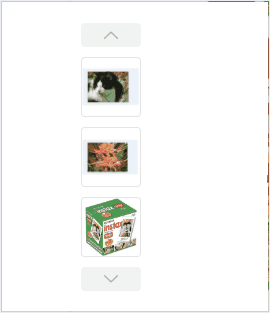

卡片式轮播组件
=============

## 效果图

## 参数Attributes

|参数|说明|类型|可选值|默认值|是否必须|
|---|---|---|---|---|-----|
|images|要展示的图片|`{Array<String>}`|-|-|是|
|show-size|轮播图的数量|`Number`|-|3|否|
|image-class|为轮播图添加的类名|`String`|-|-|否|
|image-active-class|轮播图被选中时添加的类名|`String`|-|-|否|
|auto-slide|是否自动轮播|`Boolean`|-|false|否|
|auto-slide-interval|开启自动轮播时，切换图片的时间间隔|`Number`|-|3000|否|
|mode|选择展示的模式，有水平模式和垂直模式|`String`|horizontal/vertical|horizontal|否|
|slide-time|切换图片过程中动画的事件|`Number`|-|300|否|

## 事件Events

|事件类型|说明|回调参数|
|---|---|---|
|autoslide-image|开启自动轮播时，每切换图片都触发的事件|轮播到的图片的url|
|click-image|点击图片时触发的事件|被点击图片的url|